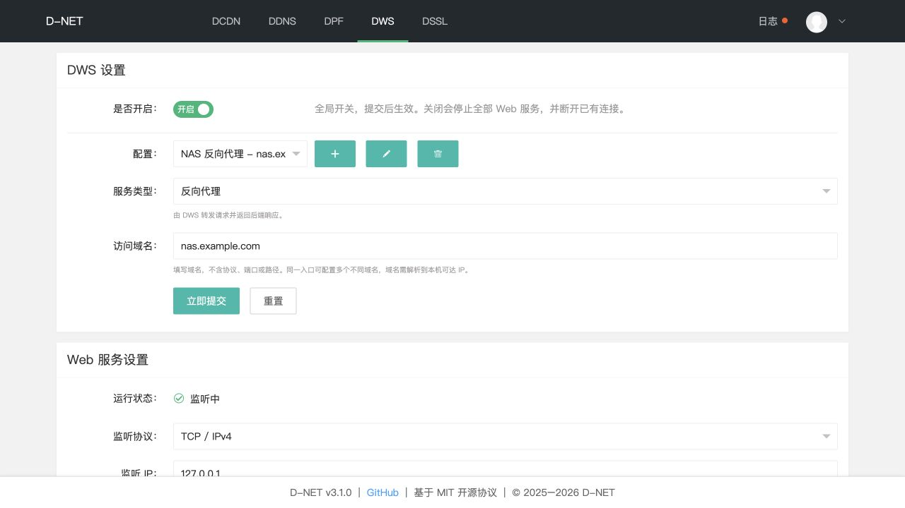

<div align="center">

# D-NET 动态网络管理系统
一款轻量级动态网络管理工具，支持多平台 CDN、DNS 自动更新，以及 TCP / UDP 端口转发。

[](LICENSE)
[](https://go.dev/)
[](https://github.com/cxbdasheng/dnet/releases)
[](https://goreportcard.com/report/github.com/cxbdasheng/dnet)
[](https://hub.docker.com/r/cxbdasheng/dnet)
[](https://github.com/cxbdasheng/dnet/releases)

[主要功能](#主要功能) • [快速开始](#快速开始) • [最佳实践](https://github.com/cxbdasheng/dnet/wiki/%E6%9C%80%E4%BD%B3%E5%AE%9E%E8%B7%B5) • [Wiki 文档](https://github.com/cxbdasheng/dnet/wiki)
</div>

---

## 主要功能

- **动态 CDN 管理 (DCDN)：** 根据 IP 变化自动更新 CDN 源站，支持阿里云（CDN、DCDN、ESA）、腾讯云（CDN、EdgeOne）、百度云（CDN、DRCDN）、Cloudflare、又拍云、自定义回调（Callback）
- **动态 DNS 管理 (DDNS)：** 根据 IP 变化自动更新 DNS 解析，支持 **A / AAAA / CNAME / TXT** 记录，支持阿里云、腾讯云、百度云、Cloudflare、华为云、Dnspod、NameSilo、GoDaddy、自定义回调（Callback）
- **TCP / UDP 端口转发 (DPF)：** IPv4 / IPv6 入口转发到指定 IP 或域名，支持来源白名单、连接 / 会话数限制、超时设置和运行日志。UDP 使用独立客户端会话，空闲超时为 0 时按 60 秒回收。支持 TCP 目标连通性测试。
- **Webhook 通知：** 实时推送 IP 变更通知
- **Web 管理界面：** 可视化配置和管理

### 界面


## 快速开始

> 更多使用示例和详细配置说明见 [Wiki](https://github.com/cxbdasheng/dnet/wiki)，常见问题见 [FAQ](https://github.com/cxbdasheng/dnet/wiki/FAQ)。

### 方式一：使用二进制文件

#### 1. 下载安装

从 [Releases](https://github.com/cxbdasheng/dnet/releases) 页面下载适合您系统的版本并解压。

#### 2. 安装为系统服务

**Mac/Linux:**
```bash
sudo ./dnet -s install
```

**Windows（管理员权限）：**
```bash
.\dnet.exe -s install
```

#### 3. 访问 Web 界面

浏览器访问 `http://localhost:9877` 进行配置。

#### 服务管理

```bash
# 卸载服务
sudo ./dnet -s uninstall          # Mac/Linux
.\dnet.exe -s uninstall           # Windows (管理员)

# 重启服务
sudo ./dnet -s restart            # Mac/Linux
.\dnet.exe -s restart             # Windows (管理员)
```

#### 高级选项

安装服务时可以指定以下参数：

| 参数                | 说明                       | 示例                        |
|-------------------|----------------------------|---------------------------|
| `-l`              | 监听地址                   | `-l :9877`                |
| `-f`              | 同步间隔时间（秒）          | `-f 300`                  |
| `-c`              | 自定义配置文件路径          | `-c /path/to/config.yaml` |
| `-u`              | 升级当前 D-NET 版本        | `-u`                      |
| `-noweb`          | 不启动 Web 服务            | `-noweb`                  |
| `-skipVerify`     | 业务请求跳过 HTTPS 证书验证（默认关闭） | `-skipVerify`             |
| `-dns`            | 自定义 DNS 服务器          | `-dns 8.8.8.8`            |
| `-dcdnCacheTimes` | 每隔 N 次强制同步一次 CDN 记录 | `-dcdnCacheTimes 10`      |
| `-ddnsCacheTimes` | 每隔 N 次强制同步一次 DNS 记录 | `-ddnsCacheTimes 10`      |
| `-resetPassword`  | 重置密码                   | `-resetPassword newpass`  |

> `-skipVerify` 仅影响云服务商 API、Webhook 和公网 IP 探测等业务 HTTPS 请求；自动更新始终严格验证证书。启用后无法验证服务端身份，存在中间人攻击风险，请仅在受控网络或必须使用自签名证书时临时使用。
>
> 正常运行时会在启动同步任务前检查 DNS 解析能力，最长等待 60 秒。Web 管理界面会优先启动；等待超时也不会阻止周期同步任务继续运行。
>
> 更多使用参数，请查看 [Wiki 文档 - D‐NET 使用指南](https://github.com/cxbdasheng/dnet/wiki/D%E2%80%90NET-%E4%BD%BF%E7%94%A8%E6%8C%87%E5%8D%97#%E5%91%BD%E4%BB%A4%E5%8F%82%E6%95%B0)。

**使用示例：**
```bash
# 自定义同步间隔和配置文件路径
./dnet -s install -f 300 -c /path/to/config.yaml

# 重置密码
./dnet -resetPassword 123456
```
### 方式二：使用 Docker

**Linux（推荐 Host 模式）：**
```bash
docker run -d --name dnet --net=host -v /opt/dnet:/root --restart=always cxbdasheng/dnet:latest
```

**macOS / Windows（端口映射）：**
```bash
docker run -d --name dnet -p 9877:9877 -v /opt/dnet:/root --restart=always cxbdasheng/dnet:latest
```

> **说明：** Host 模式支持 IPv6 地址检测（仅 Linux）；**端口映射无法直接获取宿主机的网卡信息，可能无法检测 IPv6**。

**常用命令：**
```bash
# 重置密码
docker exec dnet ./dnet -resetPassword 123456 && docker restart dnet

# 查看日志
docker logs -f dnet
```

**本地构建镜像：**
```bash
make docker          # 使用容器内 Go 工具链构建 dnet:<version>，不会推送
make docker-buildx   # 将四平台 OCI archive 输出到 dist/
```

`make docker-buildx` 会先检查当前 Buildx builder 是否支持全部目标平台；若缺少 `linux/arm/v7` 等平台，请启用 Docker Desktop 的 QEMU/binfmt 仿真，或切换到兼容的 builder。推送镜像必须显式指定目标，例如 `make docker-push PUSH_IMAGE=example.com/user/dnet`。

### 方式三：从源码构建
```bash
make build                              # 构建当前平台
goreleaser build --snapshot --clean     # 构建所有平台
go run main.go                          # 直接运行
```

## Webhook 通知

支持的变量：

| 变量名  | 说明  | 示例值                 |
|---|---|---------------------|
| `#{serviceType}` | 服务类型 | `DCDN`、`DDNS` |
| `#{serviceName}` | 服务名称（域名） | `ddns.example.com` |
| `#{serviceStatus}` | 更新结果 | `成功`、`失败`、`未改变` |
| `#{changeDetail}` | 本次变更明细（旧值→新值） | `A: 1.1.1.1 -> 2.2.2.2` |
| `#{timestamp}`  | 时间戳  | 20060102150405      |
| `#{datetime}`  | 日期时间  | 2006-01-02 15:04:05 |
| `#{hostname}`  | 主机名  |                     |

**请求方式：**
- RequestBody 为空 → 发送 **GET** 请求
- RequestBody 不为空 → 发送 **POST** 请求

**配置示例：**

- <details><summary>钉钉机器人</summary>

  - 钉钉群设置 -> 智能群助手 -> 添加机器人 -> 自定义
  - 安全设置勾选 `自定义关键词`，关键词需包含在 RequestBody 中，如：`D-NET`
  - URL 中输入钉钉提供的 `Webhook 地址`
  - RequestBody 中输入
    ```json
    {
      "msgtype": "markdown",
      "markdown": {
        "title": "D-NET 同步通知",
        "text": "#### D-NET 同步通知 \n - 服务类型：#{serviceType} \n - 服务名称：#{serviceName} \n - 更新结果：#{serviceStatus} \n - 变更明细：#{changeDetail} \n - 主机名称：#{hostname} \n - 通知时间：#{datetime} \n"
      }
    }
    ```
  </details>

- <details><summary>飞书</summary>

  - 飞书电脑端 -> 群设置 -> 添加机器人 -> 自定义机器人
  - 安全设置只勾选 `自定义关键词`，输入的关键字必须包含在 RequestBody 的 content 中，如：`D-NET`
  - URL 中输入飞书给你的 `Webhook 地址`
  - RequestBody 中输入
    ```json
    {
      "msg_type": "post",
      "content": {
        "post": {
          "zh_cn": {
            "title": "D-NET 同步通知",
            "content": [
              [{"tag": "text", "text": "服务类型：#{serviceType}"}],
              [{"tag": "text", "text": "服务名称：#{serviceName}"}],
              [{"tag": "text", "text": "更新结果：#{serviceStatus}"}],
              [{"tag": "text", "text": "变更明细：#{changeDetail}"}],
              [{"tag": "text", "text": "主机名称：#{hostname}"}],
              [{"tag": "text", "text": "通知时间：#{datetime}"}]
            ]
          }
        }
      }
    }
    ```
  </details>

- <details><summary>Server酱</summary>

  - 在 [Server酱](https://sct.ftqq.com/) 获取 `SendKey`
  - URL 中输入
    ```
    https://sctapi.ftqq.com/[SendKey].send?title=D-NET通知&desp=#{serviceName} - #{serviceStatus} - #{changeDetail}
    ```
  - RequestBody 留空（发送 GET 请求）
  </details>

- <details><summary>pushplus 推送加</summary>

  - 在 [pushplus](https://www.pushplus.plus/push1.html) 获取 token
  - URL 中输入 `https://www.pushplus.plus/send`
  - RequestBody 中输入
    ```json
    {
      "token": "your token",
      "title": "D-NET 同步通知",
      "content": "#### D-NET 同步通知 \n - 服务类型：#{serviceType} \n - 服务名称：#{serviceName} \n - 更新结果：#{serviceStatus} \n - 变更明细：#{changeDetail} \n - 主机名称：#{hostname} \n - 通知时间：#{datetime} \n"
    }
    ```
  </details>

- <details><summary>Discord</summary>

  - Discord 任意客户端 -> 服务器 -> 频道设置 -> 整合 -> 查看 Webhook -> 新 Webhook -> 复制 Webhook 网址
  - URL 中输入 Discord 复制的 `Webhook 网址`
  - RequestBody 中输入
    ```json
    {
      "content": "D-NET 同步通知",
      "embeds": [
        {
          "description": "#### D-NET 同步通知 \n - 服务类型：#{serviceType} \n - 服务名称：#{serviceName} \n - 更新结果：#{serviceStatus} \n - 变更明细：#{changeDetail} \n - 主机名称：#{hostname} \n - 通知时间：#{datetime}",
          "color": 15258703,
          "author": {"name": "D-NET"},
          "footer": {"text": "D-NET #{serviceStatus}"}
        }
      ]
    }
    ```
  </details>

- <details><summary>微信</summary>

  - 通过 [微信 ClawBot 协议](https://www.npmjs.com/package/@tencent-weixin/openclaw-weixin) 推送消息到微信
  - 需要先通过协议获取 `$your_bot_token` 和 `$your_user_id`，可参考 [weixin-bot-api](https://github.com/hao-ji-xing/openclaw-weixin/blob/main/weixin-bot-api.md)
  - URL 中输入 `https://ilinkai.weixin.qq.com/ilink/bot/sendmessage`
  - RequestBody 中输入
    ```json
    {
      "msg": {
        "from_user_id": "",
        "to_user_id": "$your_user_id@im.wechat",
        "client_id": "dnet-#{timestamp}",
        "message_type": 2,
        "message_state": 2,
        "item_list": [
          {
            "type": 1,
            "text_item": {
              "text": "📡 D-NET 同步通知\n   服务类型：#{serviceType}\n   服务名称：#{serviceName}\n   更新结果：#{serviceStatus}\n   变更明细：#{changeDetail}\n   主机名称：#{hostname}\n   通知时间：#{datetime}"
            }
          }
        ]
      },
      "base_info": {
        "channel_version": "2.1.7"
      }
    }
    ```
  - Headers 中输入
    ```
    Content-Type: application/json
    AuthorizationType: ilink_bot_token
    Authorization: Bearer $your_bot_token
    iLink-App-Id: bot
    iLink-App-ClientVersion: 131335
    ```
  </details>

> 详细 Webhook 配置参考 [Wiki 文档 - WebHook 配置指南](https://github.com/cxbdasheng/dnet/wiki/WebHook-%E9%85%8D%E7%BD%AE%E6%8C%87%E5%8D%97)。

### 反向代理与客户端 IP
默认仅使用连接来源地址判断客户端 IP，不信任客户端提供的 `X-Forwarded-For` 和 `X-Real-IP`。
通过反向代理部署时，请设置环境变量 `DNET_TRUSTED_PROXIES`，以逗号分隔可信代理的 IP 或 CIDR，例如 `127.0.0.1,::1,10.0.0.2/32`。
仅填写实际代理地址，不要将所有客户端网段加入可信列表。代理应覆盖 `X-Real-IP`，或在 `X-Forwarded-For` 末尾追加真实连接来源地址。
程序从右向左检查转发链，取第一个不受信任的地址作为客户端 IP；可信代理缺少有效客户端信息时，无法通过“禁止公网访问”检查。
## 贡献与许可
欢迎贡献代码或提出建议，详见 [贡献指南](CONTRIBUTING.md)。本项目采用 [MIT](LICENSE) 许可证。
